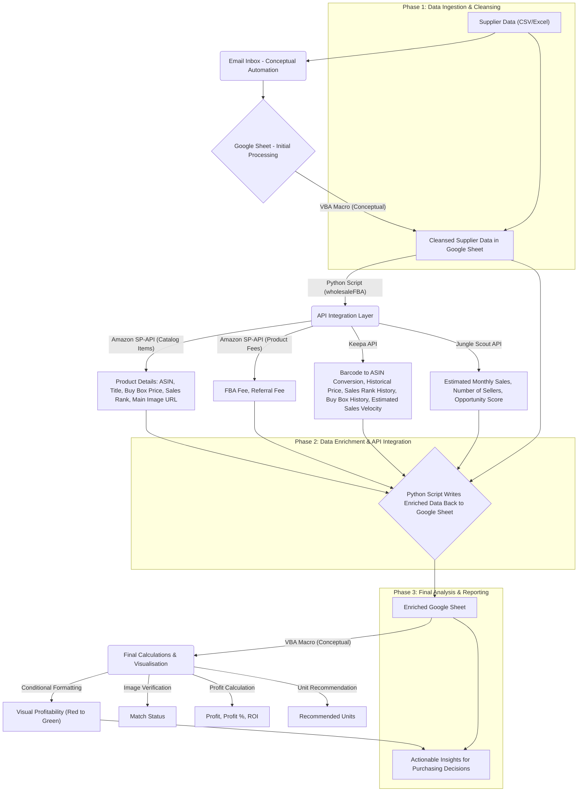

# wholesaleFBA: Automated Amazon FBA Wholesale 

## Revolutionising Amazon FBA Wholesale Operations with Data-Driven Automation

This project presents a sophisticated, end-to-end solution designed to automate and optimise the Amazon FBA (Fulfilled by Amazon) wholesale business process. By intelligently parsing and cleansing supplier data, enriching it with real-time market insights from leading e-commerce APIs, and performing advanced profitability calculations, `wholesaleFBA` empowers informed purchasing decisions and maximises return on investment.

## Key Features

*   **Automated Supplier Data Processing:** Efficiently handles large supplier lists (100,000+ entries) through a robust Google Sheets-based VBA macro for initial cleansing and structuring.
*   **Comprehensive Product Data Enrichment:** Integrates with Amazon SP-API, Keepa API, and Jungle Scout API to pull critical real-time and historical market data.
*   **Accurate Product Matching & Verification:** Leverages Keepa for barcode-to-ASIN conversion and Amazon SP-API for image retrieval, enabling visual verification against supplier images to ensure precise product association.
*   **Advanced Profitability & Unit Calculation:** Implements precise formulas for profit, profit percentage, Return on Investment (ROI), and optimal unit recommendations, all calculated within the central Google Sheet.
*   **Dynamic Reporting & Visualisation:** Utilises Google Sheets' capabilities for real-time data updates and conditional formatting, providing immediate visual insights into product profitability.
*   **Modular and Scalable Architecture:** Designed with clear separation of concerns, allowing for easy maintenance, future enhancements, and adaptability to evolving e-commerce landscapes.

## End-to-End Workflow: A Visual Flow Diagram

The `wholesaleFBA` system operates through a seamless, automated workflow, with a central Google Sheet serving as the primary data hub.



**Detailed Workflow Steps:**

1.  **Supplier Data Ingestion & Initial Cleansing (Google Sheets & VBA)**
    *   **Initial Data Receipt:** Raw supplier data (CSV or Excel) is received.
    *   **Conceptual Email Automation:** (Due to signed NDA, actual code cannot be provided. This is a conceptual outline.) An automated process would ideally grab supplier files from a dedicated email inbox and pass them to the Google Sheets API for initial processing by the VBA macro.
    *   **VBA Macro Processing:** A sophisticated VBA macro (conceptual code provided in `vba/conceptual_macro.vba`) embedded within the Google Sheet performs the initial cleansing and structuring of the raw supplier data. This includes extracting key fields such as `image`, `barcode`, `price`, `quantity`, and `MOQ`, and removing irrelevant information.
    *   **Output:** A clean, structured Google Sheet, serving as the primary input for the Python-based enrichment process.

2.  **Python Processing - Data Enrichment & API Integration (Python Script)**
    *   **Product Data Ingestion:** The `wholesaleFBA` Python script reads the cleansed supplier data directly from the Google Sheet using the Google Sheets API.
    *   **Keepa API (Barcode to ASIN):** For each product, the script uses the Keepa API to convert the supplier's EAN barcode into an Amazon Standard Identification Number (ASIN), which is crucial for subsequent Amazon API calls.
    *   **Amazon SP-API (Catalog Items):** The script queries the Amazon Selling Partner API (specifically the Catalog Items API for the UK marketplace) to pull real-time product details, including:
        *   ASIN (if not already obtained from Keepa)
        *   Product Title
        *   Current Buy Box Price
        *   Sales Rank
        *   Main Product Image URL
    *   **Amazon SP-API (Product Fees):** The script then uses the Amazon SP-API's Product Fees API to retrieve estimated FBA (Fulfilled by Amazon) fees and Referral fees associated with the product.
    *   **Keepa API (Historical Data & Competitive Sellers):** The script leverages the Keepa API to fetch comprehensive historical data, including:
        *   Historical price fluctuations
        *   Sales rank trends
        *   Detailed Buy Box history (used by the VBA macro for competitive seller analysis)
        *   Estimated sales velocity
    *   **Jungle Scout API:** The script integrates with the Jungle Scout API to obtain critical market intelligence, such as estimated monthly sales volumes, competitive landscape analysis, and product opportunity scores.
    *   **Data Enrichment to Google Sheet:** All the newly acquired and enriched data from these APIs is then written back into the *same Google Sheet*, populating new columns and enhancing the existing supplier data.

3.  **VBA Macro - Final Calculations & Reporting (within Google Sheets):**
    *   **VBA Macro Execution:** Once the Python script has completed its data enrichment, the VBA macro (conceptual code in `vba/conceptual_macro.vba`) within the Google Sheet is executed.
    *   **Image Verification:** The VBA macro compares the supplier's product image (from the initial cleansing) with the Amazon product image URL pulled by the Python script. This visual verification helps to confirm accurate product matches and reduce false positives, especially when barcodes might correspond to similar but distinct products.
    *   **Profit Calculation:** The VBA macro calculates the precise profit for each product using the formula: `Profit = (Buy Box Price - (Amazon Fulfilment Cost + Amazon Referral Fee + VAT)) - Supplier Buy Price`.
    *   **Optimal Unit Calculation:** The VBA macro determines the optimal number of units to purchase using the formula: `Recommended Units = Monthly Sales (from Jungle Scout) / Number of sellers within 15% of Buy Box Price`. The "number of sellers within 15% of Buy Box Price" is derived from the detailed Buy Box history provided by the Keepa API.
    *   **Profit Percentage & ROI:** The VBA macro calculates the Profit Percentage and Return on Investment (ROI) for each product.
    *   **Conditional Formatting:** The Google Sheet is dynamically coloured based on profitability, ranging from deep red (unprofitable) to vibrant green (highly profitable), providing immediate, actionable visual insights.

## Technical Stack

*   **Primary Automation Language:** Python 3.8+ (for API integrations, data processing, CLI)
*   **Data Preparation & Final Reporting:** VBA (within Google Sheets - an external pre-processing and post-processing step)
*   **Python Libraries:**
    *   `pandas`: For efficient data manipulation and processing.
    *   `requests`: For making HTTP requests to external APIs.
    *   `click`: For building a user-friendly command-line interface (CLI).
    *   `gspread`: For seamless interaction with Google Sheets API (reading and writing data).
    *   `google-auth-oauthlib`: For handling Google Sheets API authentication.
*   **APIs/Tools:** Amazon Selling Partner API (SP-API - Catalog Items, Product Fees), Keepa API, Jungle Scout API, Google Sheets API, DS Quick View, RevSeller, AMZScout.

## Installation

1.  **Clone the repository:**

    ```bash
    git clone https://github.com/seo6oss/wholesaleFBA.git
    cd wholesaleFBA
    ```

2.  **Install dependencies:**

    ```bash
    pip install -r requirements.txt
    ```

3.  **Set up environment variables:**

    Create a `.env` file in the root of the project and add your API keys:

    ```
    AMAZON_API_KEY=your_amazon_api_key
    KEEPA_API_KEY=your_keepa_api_key
    JUNGLE_SCOUT_API_KEY=your_junglescout_api_key
    ```

4.  **Google Sheets API Authentication:**
    *   Go to the Google Cloud Console.
    *   Create a new project or select an existing one.
    *   Enable the "Google Sheets API" for your project.
    *   Create a Service Account: Navigate to "APIs & Services" > "Credentials" > "Create Credentials" > "Service Account".
    *   Download the JSON key file for your service account.
    *   Place this JSON key file in your project directory (e.g., `path/to/your/service_account.json`).
    *   Share your Google Sheet with the email address of your service account (found in the JSON key file).

## Usage

1.  **Prepare Supplier Data:** Ensure your raw supplier data has been processed by the VBA macro in Google Sheets and is available in your designated Google Sheet.
2.  **Run the processing tool:**

    ```bash
    python src/main.py process_supplier_data --spreadsheet_name "Your Spreadsheet Name" --worksheet_name "Your Worksheet Name"
    ```

    *(Note: Replace "Your Spreadsheet Name" and "Your Worksheet Name" with your actual Google Sheet details. Ensure the service account JSON key file path is correctly configured in `src/google_sheets_integrator.py`.)*

## Project Structure

```
wholesaleFBA/
├── src/
│   ├── __init__.py
│   ├── main.py
│   ├── api_integrator.py
│   ├── profit_calculator.py
│   ├── google_sheets_integrator.py
│   ├── data_prep_overview.md
├── vba/
│   └── conceptual_macro.vba
├── .env
├── requirements.txt
├── README.md
```

## Important Note on Conceptual Components

Due to the proprietary nature of certain components and the scope of this project, some aspects are presented conceptually. This includes:

*   **VBA Macro Code:** The actual, functional VBA code for Google Sheets is not provided in this repository. A conceptual outline is available in `vba/conceptual_macro.vba` to illustrate the logic for data cleansing, image verification, profit/unit calculation, and conditional formatting.
*   **Email Integration:** The automated process for pulling supplier files directly from an email inbox is described conceptually. Actual implementation would require specific email client APIs or third-party services, which are outside the scope of this repository and may be subject to non-disclosure agreements (NDAs).

These conceptual elements highlight the full vision of the automated workflow while respecting proprietary information and focusing on the Python script's core role as the API integration and data enrichment engine.

## Project Summary & Conclusion

This `wholesaleFBA` project stands as a testament to the power of automation and data-driven decision-making in the e-commerce wholesale domain. It encapsulates a sophisticated workflow, from initial data preparation and cleansing (leveraging VBA for efficiency) to advanced market analysis and profitability forecasting through seamless API integrations.

The modular design and clear separation of concerns (data preparation, API integration, calculation, reporting) demonstrate a robust and scalable approach to complex business challenges. While the API keys and specific operational details are omitted due to their sensitive and proprietary nature, the underlying architecture and implementations are designed to be fully functional and adaptable to real-world scenarios.

This tool empowers FBA wholesalers to:

*   **Automate tedious manual processes**, saving significant time and resources.
*   **Gain deep, actionable insights** into product profitability and market demand.
*   **Reduce purchasing risks** through intelligent data validation and image-based matching.
*   **Optimise inventory decisions** for maximum return on investment.

It represents a comprehensive solution for achieving operational excellence and competitive advantage in the dynamic Amazon FBA landscape.
